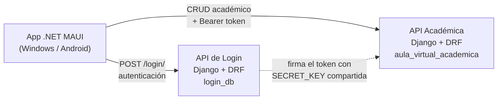
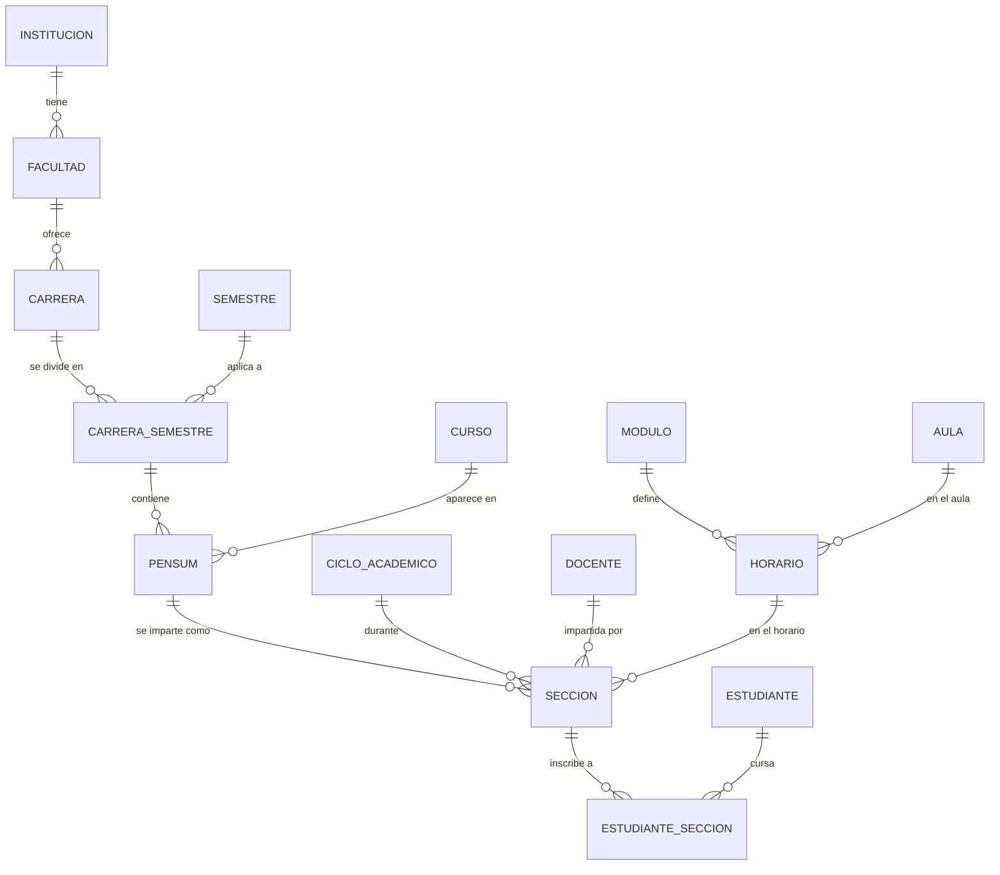
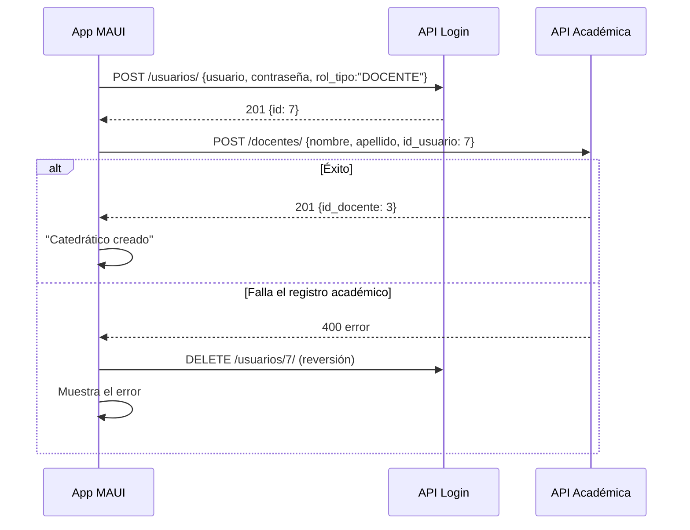
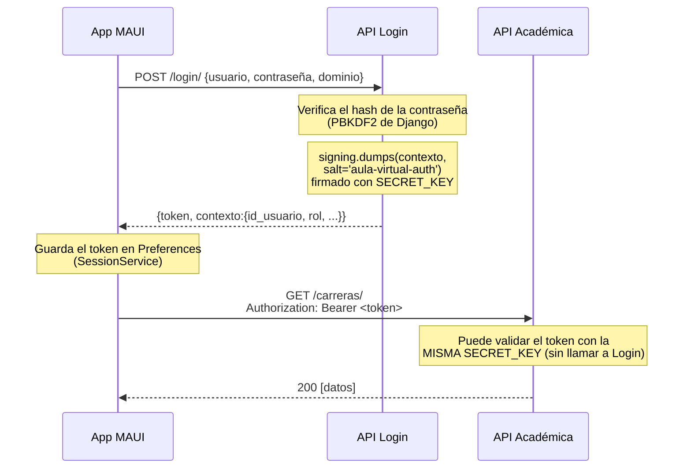

# Arquitectura del Aula Virtual UMES

Documento de apoyo para explicar el proyecto: qué módulos lo componen, cómo se
relacionan los IDs entre ellos y cómo se integran las dos APIs separadas.

---

## 1. Visión general: tres piezas independientes



| Módulo | Tecnología | Responsabilidad | Base de datos |
|---|---|---|---|
| `AulaVirtualApp/` | .NET 10 MAUI (C#/XAML) | Interfaz. No tiene lógica de negocio ni acceso directo a BD. | — |
| `Backend/login/` | Django 6 + DRF | **Quién eres**: usuarios, contraseñas, roles, emisión del token. | `login_db` |
| `Backend/aula/` | Django 6 + DRF | **Qué hay**: catálogo académico completo (carreras, cursos, docentes, asignaciones). | `aula_virtual_academica` |

**Por qué dos APIs y dos bases:** separa autenticación de datos académicos. La
API de login es genérica y podría dar servicio a varias instituciones o
sistemas; la académica es el producto en sí. El costo de esa separación es que
no puede existir una llave foránea real entre ambas (ver sección 3).

---

## 2. El modelo de datos académico y la cadena de IDs

El diseño está normalizado: cada concepto vive en su propia tabla y se relaciona
por ID. La entidad central es **`seccion`**, que es donde converge todo.



### Cómo leer la cadena

Cada tabla intermedia existe para resolver una relación **muchos-a-muchos** sin
duplicar datos:

1. **`carrera_semestre`** — un semestre (el número 1, 2, 3…) no pertenece a una
   carrera: el semestre 1 existe para todas. Esta tabla dice *"la carrera X sí
   tiene un semestre 1"*.
2. **`pensum`** — un curso tampoco pertenece a una carrera: "Matemática I" puede
   estar en Ingeniería y en Arquitectura, en semestres distintos. El pensum dice
   *"el curso Matemática I se imparte en el semestre 1 de Ingeniería"*.
3. **`seccion`** — es la **oferta real** de ese curso: toma un registro de pensum
   y le agrega *cuándo* (ciclo académico), *quién* (docente) y *dónde/a qué hora*
   (horario). Aquí es donde el administrador "asigna un catedrático a un curso".
4. **`estudiante_seccion`** — inscribe a un alumno en una sección concreta.

> **Punto clave para explicar:** por eso la pantalla "Asignar catedrático a curso"
> pide *pensum + ciclo + docente + horario*: no se asigna un profesor a un curso
> en abstracto, sino a la impartición concreta de ese curso en un ciclo, aula y
> horario determinados. Y por eso hay que crear primero los "datos de apoyo"
> (ciclo, aula, módulo, horario) antes de poder hacer esa asignación.

### Nombres de llave primaria

Las tablas de la API académica **no usan `id`**, sino nombres explícitos:
`id_institucion`, `id_facultad`, `id_carrera`, `id_pensum`, `id_seccion`, etc.
Esto viene del diseño en SQL (`Base de datos general.sql`), y los modelos de
Django lo respetan con `db_column` + `primary_key=True`.

Esto tiene una consecuencia en el código de la app: `EntityConfig.IdField` guarda
el nombre real de la PK de cada entidad, para que las pantallas genéricas de
lista y formulario sepan qué campo leer al editar, eliminar o llenar un selector.

---

## 3. La integración entre las dos APIs

Aquí está lo distintivo del proyecto. Hay **dos mecanismos de integración**.

### 3.1 Integración de identidad: `id_usuario` como llave foránea lógica

Las tablas `docente` y `estudiante` (en la BD académica) necesitan saber a qué
cuenta de acceso corresponden. Pero esa cuenta vive en **otra base de datos**, así
que no puede haber un `REFERENCES` real:

```sql
CREATE TABLE docente (
    id_docente      SERIAL PRIMARY KEY,
    id_institucion  INTEGER NOT NULL REFERENCES institucion(id_institucion),
    nombre          VARCHAR(100) NOT NULL,
    apellido        VARCHAR(100) NOT NULL,
    id_usuario      INTEGER NOT NULL UNIQUE  -- ref. LÓGICA a login_db.usuario
);
```

`id_usuario` guarda el ID del usuario en la otra base. Es una **referencia
lógica**: la aplicación mantiene la consistencia, no el motor de base de datos.
El `UNIQUE` garantiza que una misma cuenta no quede ligada a dos docentes.

**Implicación honesta que conviene reconocer:** PostgreSQL no puede impedir que
quede un `id_usuario` apuntando a un usuario que ya no existe. Es el precio de
separar las bases, y es una decisión de diseño consciente, no un descuido.

### 3.2 Creación en dos pasos, con reversión

Cuando el administrador crea un catedrático, la app tiene que coordinar las dos
APIs. Si el segundo paso falla, revierte el primero para no dejar cuentas
huérfanas:



Implementado en `Pages/CrearDocentePage.xaml.cs` y `CrearEstudiantePage.xaml.cs`.
Es el motivo por el que esas dos pantallas no usan el formulario genérico.

### 3.3 Integración de sesión: token firmado con secreto compartido

Las dos APIs comparten la misma variable de entorno **`AULA_SHARED_SECRET_KEY`**.
Eso permite que la API académica **verifique un token emitido por la de login**,
sin necesidad de consultarla ni de compartir base de datos:



El token es un `django.core.signing.dumps` con:
- **salt:** `'aula-virtual-auth'` (idéntico en ambas APIs)
- **vigencia:** 8 horas (`max_age=60*60*8`)
- **contenido:** `id_usuario`, `id_institucion`, `institucion`, `dominio`,
  `usuario`, `rol`

> **Importante:** el token está **firmado, no cifrado**. Su contenido se puede
> leer en base64; lo que garantiza la firma es que *nadie lo pudo alterar* sin
> conocer la `SECRET_KEY`. No se deben poner datos sensibles dentro.

---

## 4. Manejo de roles

El rol viaja dentro del token y del contexto. La app enruta según ese valor
(`Pages/LoginPage.xaml.cs`):

| Rol | Pantalla de destino | Estado en Fase 1 |
|---|---|---|
| `ADMINISTRADOR` | `AdminDashboardPage` | Funcionalidad completa |
| `DOCENTE` | `RoleHomePage` | Pantalla de bienvenida (Fase 2) |
| `ESTUDIANTE` | `RoleHomePage` | Pantalla de bienvenida (Fase 2) |

Los usuarios de docente y estudiante **no se auto-registran**: los crea el
administrador desde las pantallas de Catedráticos y Alumnos, que es exactamente
lo que pide el enunciado.

---

## 5. Estructura del código de la app

La app evita repetir XAML para cada una de las ~15 entidades administrables
mediante un patrón de **catálogo dirigido por configuración**:

```
Config/EntityCatalog.cs   Define cada entidad: endpoint, PK real, campos,
                          cómo se muestra en lista, de qué endpoint se llenan
                          sus selectores.
        │
        ├──> Pages/EntityListPage    Una sola pantalla de lista para todas.
        └──> Pages/EntityFormPage    Un solo formulario, construido en tiempo
                                     de ejecución a partir de los campos.

Services/ApiClient.cs     Cliente HTTP genérico (GET/POST/PUT/DELETE), adjunta
                          el Bearer token y traduce errores de DRF a mensajes.
Services/SessionService   Token y contexto de sesión, persistidos en Preferences.
Services/ApiConfig.cs     URLs base de ambas APIs (configurables en la app).
```

Agregar una entidad nueva al panel de administrador es agregar un método a
`EntityCatalog` y un botón — no una pantalla nueva.

---

## 6. Limitación conocida (conviene mencionarla tú antes de que la pregunten)

**Los endpoints de datos no exigen el token.** La app envía
`Authorization: Bearer <token>` en cada petición, y la API académica *sabe*
validarlo (endpoint `/api/contexto/`), pero los `ModelViewSet` de CRUD no tienen
`permission_classes`, y DRF usa `AllowAny` por defecto. En la práctica, hoy
cualquiera con la URL puede consultar o modificar los datos.

Para Fase 1 —cuyo objetivo es login, roles y funcionalidad del administrador—
no impide cumplir ningún punto de la rúbrica. Cerrarlo es pequeño: una clase de
permiso que valide el token y se registre en `DEFAULT_PERMISSION_CLASSES`.
Reconocerlo como trabajo pendiente identificado es mejor que presentarlo como
si estuviera resuelto.

---

## 7. Guion sugerido para explicar el proyecto (5 minutos)

1. **Las tres piezas** (30 s) — app MAUI, API de login, API académica; cada API
   con su propia base de datos.
2. **Login** (1 min) — la app manda usuario y contraseña; la API valida el hash
   PBKDF2 y devuelve un token firmado que incluye el rol. Mostrar el login con
   los tres roles y cómo cada uno llega a una pantalla distinta.
3. **La cadena académica** (1.5 min) — recorrer Facultad → Carrera → Semestre por
   carrera → Curso → Pensum, explicando *por qué* existen las tablas intermedias
   (relaciones muchos-a-muchos) y cerrando en Sección como la oferta real.
4. **La integración entre APIs** (1.5 min) — los dos mecanismos: `id_usuario`
   como llave foránea lógica, y la `SECRET_KEY` compartida que permite a la API
   académica validar un token que ella no emitió. Mostrar la creación de un
   catedrático como ejemplo de coordinación entre ambas, con reversión si falla.
5. **Despliegue** (30 s) — ambas APIs publicadas en Render con PostgreSQL
   administrado; la app consume esas URLs (ver `DEPLOY.md`).
